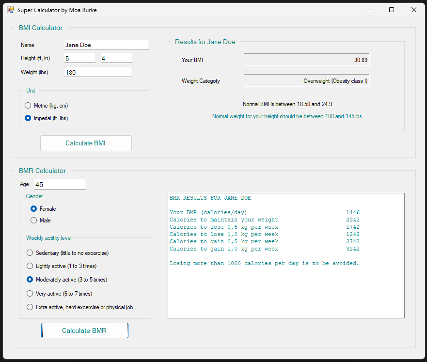

# BMI and BMR Calculator

## Overview

The BMI and BMR Calculator is a Windows Forms application developed in C# designed to calculate Body Mass Index (BMI) and Basal Metabolic Rate (BMR). This application allows users to enter their height, weight, age, and other relevant information to calculate their BMI and BMR, providing valuable insights into their health and fitness.

## Features

- **BMI Calculation**: 
  - Supports both metric (cm, kg) and imperial (ft, in, lbs) units.
  - Displays BMI value and weight category.
  - Provides the normal weight range based on height.

- **BMR Calculation**:
  - Considers age, height, weight, gender, and activity level.
  - Displays BMR value and caloric needs for maintaining, losing, or gaining weight.

- **Dynamic GUI**:
  - Automatically adjusts input fields and labels based on the selected unit system.
  - Provides a user-friendly interface with error handling for invalid inputs.
## Usage

1. **BMI Calculation**:
   - Choose the unit system (Metric or Imperial).
   - Enter your name, height, and weight in the provided fields.
   - Click "OK" to calculate BMI.
   - View the results, including your BMI value, weight category, and normal weight range.

2. **BMR Calculation**:
   - Enter your age, height, weight, gender, and activity level.
   - Click "OK" to calculate BMR.
   - View the results, including your BMR value and caloric needs for maintaining, losing, or gaining weight.

## Code Structure

- **MainForm.cs**: Contains the main logic for handling user input, performing calculations, and displaying results.
- **BMICalculator.cs**: Handles the calculations for Body Mass Index.
- **BMRCalculator.cs**: Manages the calculations for Basal Metabolic Rate.
- **UnitTypes.cs**: Defines unit types (Metric and Imperial).
- **GenderTypes.cs**: Defines gender types (Male and Female).
- **ActivityLevelTypes.cs**: Defines activity levels (Sedentary, Lightly, Moderately, Very, Extra).
